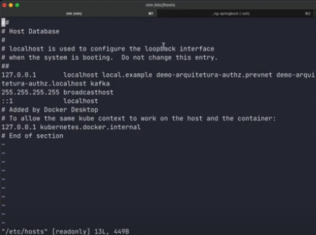

# Getting Started

### Reference Documentation
For further reference, please consider the following sections:

* [Official Gradle documentation](https://docs.gradle.org)
* [Spring Boot Gradle Plugin Reference Guide](https://docs.spring.io/spring-boot/docs/3.1.2/gradle-plugin/reference/html/)
* [Create an OCI image](https://docs.spring.io/spring-boot/docs/3.1.2/gradle-plugin/reference/html/#build-image)
* [Spring Web](https://docs.spring.io/spring-boot/docs/3.1.2/reference/htmlsinge/index.html#web)
* [Spring for Apache Kafka](https://docs.spring.io/spring-boot/docs/3.1.2/reference/htmlsinge/index.html#messaging.kafka)
* [Spring Boot DevTools](https://docs.spring.io/spring-boot/docs/3.1.2/reference/htmlsinge/index.html#using.devtools)

### Guides
The following guides illustrate how to use some features concretely:

* [Building a RESTful Web Service](https://spring.io/guides/gs/rest-service/)
* [Serving Web Content with Spring MVC](https://spring.io/guides/gs/serving-web-content/)
* [Building REST services with Spring](https://spring.io/guides/tutorials/rest/)

### Additional Links
These additional references should also help you:

* [Gradle Build Scans – insights for your project's build](https://scans.gradle.com#gradle)

# Configuração para o kafka rodar local
* com o vim etc/hosts e alterar para ser interpretado como localhost o kafka
  

* executa o comando no diretório do projeto sendo docker-compose up, assim vai subir as imagens do zookeeper e kafka